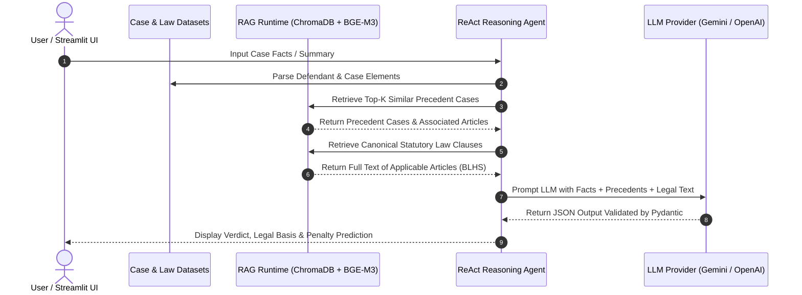

# ⚖️ Vietnamese Legal Reasoning & Verdict Generation RAG

[](https://python.org)
[]()
[](https://huggingface.co/BAAI/bge-m3)
[](https://www.trychroma.com/)
[](LICENSE)

An end-to-end **Retrieval-Augmented Generation (RAG)** and **Multi-Stage ReAct Reasoning** system designed for Vietnamese criminal law case analysis, legal basis resolution (`Điều`, `Khoản`, `Điểm`), precedent retrieval, and structured verdict text generation.

---

## 🌟 Key Features

- **Dual-Index Vector Retrieval**: Combines statutory law clause matching with historical case precedent retrieval using `BAAI/bge-m3` sentence embeddings stored in ChromaDB collections.
- **Multi-Stage ReAct Reasoning**: Decouples legal analysis into distinct LLM reasoning steps:
  1. *Fact & Entity Extraction*
  2. *Candidate Charge Generation & Element Matching*
  3. *Mandatory Statutory Article Retrieval* (Articles 38, 47, 50, 51, 52, 53, 54, 55, 65)
  4. *Structured Verdict Prediction* under Pydantic schema validation.
- **Sentencing & Penalty Parsing**: Built-in regex and NLP routines for parsing imprisonment durations (`Phat_Tu`) and measuring sentencing deviation with micro RMSE and macro MAE.
- **Comprehensive Evaluation Harness**: Evaluates retrieval accuracy (Precision, Recall, F1) across full signatures and article (`Điều`) levels, plus NLG verdict generation quality.
- **Interactive Streamlit Web App**: Clean user interface (`demo/app.py`) for step-by-step case analysis, interactive retrieval visualization, and LLM verdict generation.
- **Multi-Provider LLM Abstraction**: Unified provider interface supporting **Google Gemini (AI Studio)**, **OpenAI**, and **OpenRouter** models.

---

## 🏗️ System Architecture



---

## 📊 Benchmark & Evaluation Results

We evaluated our **Retrieval-Grounded Reasoning** system against two baseline architectures on held-out criminal case test sets:
1. **Retrieval-Grounded Reasoning (Ours)**: Multi-stage ReAct reasoning pipeline with explicit statutory law text and precedent retrieval.
2. **Single-Step Reasoning**: Direct LLM verdict generation without multi-stage legal text grounding.
3. **Past-Case Reasoning**: Baseline relying on past judgments without explicit statutory law clause grounding.

### 1. Legal Clause Identification Performance

| Metric | Retrieval-Grounded (Ours) | Single-Step Baseline | Past-Case Baseline | Improvement over Baseline |
|---|:---:|:---:|:---:|:---:|
| **Full-Signature Law $F_1$** (`Điều-Khoản-Điểm`) | **0.4893** | 0.2821 | 0.2954 | **+73.4% relative gain** |
| **Article-Level Law $F_1$** (`Điều` Only) | **0.6197** | 0.5896 | 0.3861 | **+5.1% gain** |
| **Offence-Article $F_1$** | **0.6561** | 0.6201 | 0.4150 | **+5.8% gain** |
| **Exact Article-Set Match Rate** | **10.20%** | 8.89% | 8.89% | **+14.7% relative gain** |

> 💡 **Key Insight on Legal Basis Grounding**:
> The most notable improvement is observed in strict **full-signature law $F_1$** (**0.4893** vs 0.2821 for Single-Step and 0.2954 for Past-Case). This demonstrates that explicitly retrieving and reasoning over multi-step statutory law text (`Khoản`, `Điểm`) is essential for identifying precise legal bases rather than just broad article categories.

---

### 2. Sentence Duration Prediction Performance (Imprisonment Months - Lower is Better)

| Metric (in Months) | Retrieval-Grounded (Ours) | Single-Step Baseline | Past-Case Baseline | Error Reduction |
|---|:---:|:---:|:---:|:---:|
| **Sentence MAE (Months)** | **34.48** | 57.00 | 73.63 | **39.5% reduction** vs Single-Step |
| **Sentence RMSE (Months)** | **35.48** | 59.91 | 53.97 | **40.8% reduction** vs Single-Step |

> 💡 **Key Insight on Sentencing Accuracy**:
> The multi-step retrieval-grounded pipeline significantly minimizes sentencing deviation. Carelessly injecting past cases without structured statutory evaluation severely confuses the model regarding sentencing duration (Past-Case MAE spikes to **73.63 months**). Grounding the LLM with mandatory statutory articles (Articles 38, 50, 51, 52) provides precise penalty bracket constraints and cuts sentencing error down to **34.48 months**.

---

## 🚀 Quickstart & Installation

### 1. Prerequisites & Environment Setup

Clone the repository and install the project in editable mode using `pip` or `uv`:

```bash
git clone https://github.com/your-username/vietnamese-legal-rag.git
cd vietnamese-legal-rag

# Option A: Using standard pip
pip install -e .

# Option B: Using uv (Recommended)
uv pip install -e .
```

### 2. Configure API Keys

Set your preferred provider API keys in environment variables or a `.env` file:

```bash
# Google Gemini (AI Studio)
export GOOGLE_API_KEY="your-google-api-key"

# OpenAI API
export OPENAI_API_KEY="your-openai-api-key"

# OpenRouter
export OPENROUTER_API_KEY="your-openrouter-api-key"
```

---

## 💻 CLI Commands & Usage

The package exposes convenient console commands via `pyproject.toml`:

### 1. Run Retrieval Evaluation
```bash
rag-evaluate \
    --train_dir chunk/train \
    --test_dir chunk/test \
    --train_db_dir output/chroma_db_train \
    --test_db_dir output/chroma_db_test \
    --top_k 5 \
    --results_out output/eval_results.json
```

### 2. Evaluate Embedding Models (Hybrid / Case-Only / Law-Only)
```bash
rag-evaluate-law-models \
    --train_dir chunk/train \
    --test_dir chunk/test \
    --law_json raw_law.json \
    --models BAAI/bge-m3 \
    --device cuda \
    --top_k_case 5 \
    --top_k_law 10 \
    --results_out output/law_model_eval/model_comparison.json
```

### 3. Generate Verdicts from Retrieval Output
```bash
rag-generate-verdict \
    --test-dir chunk/test \
    --eval-results output/eval_results.json \
    --law-doc law_doc.json \
    --output-dir output/generated_verdict_from_eval \
    --provider aistudio
```

### 4. Evaluate Verdict Generation Quality
```bash
rag-evaluate-generation \
    --test-dir chunk/test \
    --law-json raw_law.json \
    --results-out output/generation_eval/verdict_generation_eval.json \
    --provider openai
```

---

## 🌐 Streamlit Interactive Web App

Launch the interactive web demonstration dashboard:

```bash
streamlit run demo/app.py
```

The web dashboard allows you to:
- Select sample test case documents or paste custom facts.
- Inspect retrieved precedent cases and statutory law text side-by-side.
- Trigger real-time LLM verdict generation and view structured output predictions.

---

## 📂 Repository Structure

```
vietnamese-legal-rag/
├── rag/                        # Core Python Package
│   ├── config.py               # Shared constants, field names & default models
│   ├── core/                   # Embeddings, law chunking & clause retrievers
│   │   ├── embeddings.py       # Case text chunking & vector embedding
│   │   ├── law_retriever.py    # Hierarchical law signature resolver (Điều/Khoản/Điểm)
│   │   ├── verdict_labels.py   # Ground-truth signature label normalizer
│   │   └── sentencing.py       # Sentence duration parsing (months/years)
│   ├── runtime/                # Long-lived ChromaDB collection & model caching
│   ├── llm/                    # Unified provider interface (Gemini, OpenAI, OpenRouter)
│   ├── generation/             # Verdict generation pipelines & ReAct agents
│   └── evaluation/             # Retrieval & generation evaluation harnesses
├── demo/                       # Streamlit web application & UI components
│   ├── app.py                  # Main Streamlit dashboard entry point
│   ├── components.py           # Custom UI rendering widgets
│   ├── pipeline.py             # Demo reasoning execution pipeline
│   └── retrieval.py            # Streamlit-specific retrieval helpers
├── data_create/                # Data extraction & synthetic text generation scripts
├── docs/                       # Comprehensive documentation & thesis reports
│   ├── thesis_report.md        # Full technical thesis report
│   ├── reasoning_pipeline.md   # Detailed multi-stage ReAct prompt specifications
│   └── evaluation_guide.md     # Metric definitions & evaluation design
├── notebooks/                  # Interactive Jupyter Demonstration Notebooks
│   ├── 01_multistage_reasoning_demo.ipynb
│   ├── 02_evaluation_metrics_report.ipynb
│   └── 03_quality_check_analysis.ipynb
├── tests/                      # Unit and integration test suite
├── CV_HIGHLIGHTS.md            # Resume bullet points & technical portfolio summary
├── result.md                   # Detailed experimental evaluation metrics & LaTeX tables
├── demo.mp4                    # Video demonstration of the Streamlit application
├── pyproject.toml              # Package definition & CLI entry points
└── README.md                   # Project documentation & showcase
```

---

## 📄 CV & Portfolio Highlights

For details on adding this project to your CV or portfolio, see [CV_HIGHLIGHTS.md](CV_HIGHLIGHTS.md).

---

## 🎬 System Video Demo

Watch the interactive Streamlit demonstration video:

<video src="demo.mp4" controls width="100%"></video>

> *Note: If the embedded player above does not render in your markdown previewer, you can play [`demo.mp4`](demo.mp4) directly.*

---

## 📜 License

This project is licensed under the [MIT License](LICENSE).